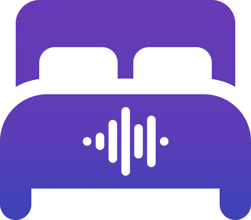

# Relax Sounds

Relax Sounds is a progressive web app that helps you relax with soothing background sounds. It lets you customize your listening experience by creating different soundscapes and saving them as presets. You can also adjust the volume and balance of each sound to create their own unique ambiance.

The backend is written in Go, and can mux the audio files into a single never-ending stream, which can be cast to any Google Cast device. This means you can enjoy your favorite sounds on your TV or speaker system for an even more immersive experience.

The frontend, built using Vue.js and Vuetify, is fully responsive and works on any device, whether it's a desktop computer, laptop, tablet, or smartphone. It's also designed to work offline, so you can continue listening to your favorite sounds even if you lose internet connectivity.
